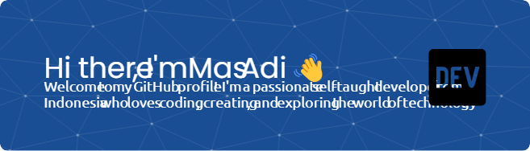

# 💫 About Me:
I'm a developer who enjoys building tools, automating boring tasks, and experimenting with web development and ethical hacking. I focus on clean, functional, and creative code. 🔧 I code in: Python, C++, HTML, CSS, JavaScript 💡 Currently learning more about backend development and cybersecurity 🎯 I love solving problems and building fun, useful projects

## 🌐 Socials:
   

# 💻 Tech Stack:
            
# 📊 GitHub Stats:
 
 

## 🏆 GitHub Trophies

### 🔝 Top Contributed Repo

---

###

###